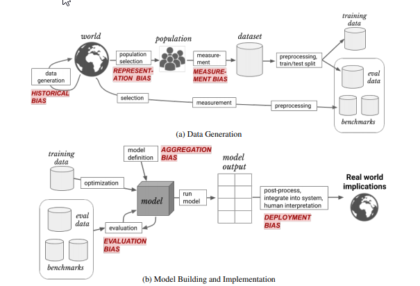

## Types of bias in AI / ML

1. Historical bias occurs when the state of the world in which the data was generated is flawed.

2. Representation bias occurs when building datasets for training a model, if those datasets poorly represent the people that the model will serve.

3. Measurement bias occurs when the accuracy of the data varies across groups. This can happen when working with proxy variables if the quality of the proxy varies in different groups.

4. Aggregation bias occurs when groups are inappropriately combined, resulting in a model that does not perform well for any group or only performs well for the majority group

5. Evaluation bias occurs when evaluating a model, if the benchmark data (used to compare the model to other models that perform similar tasks) does not represent the population that the model will serve.

6. Deployment bias occurs when the problem the model is intended to solve is different from the way it is actually used. If the end users don’t use the model in the way it is intended, there is no guarantee that the model will perform well.

A Framework for Understanding Unintended Consequences of Machine Learning [paper](https://arxiv.org/pdf/1901.10002.pdf)

